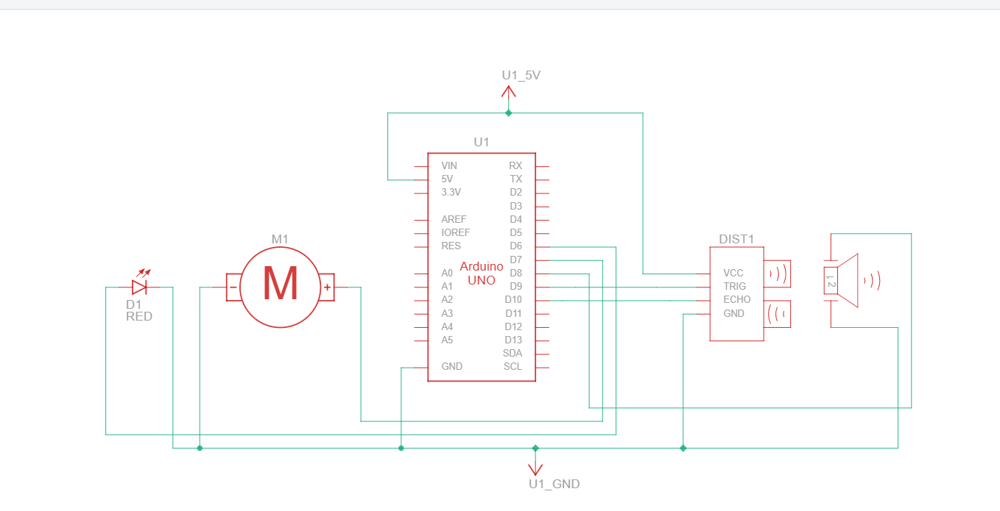
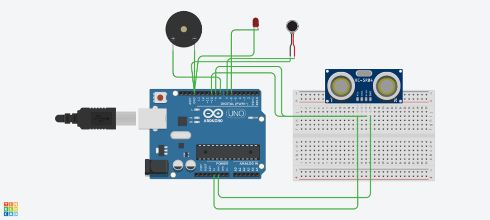

# Blind Walking Cane – Arduino Based Assistive Device

## Overview
This project is an Arduino-based assistive system designed to help visually impaired users navigate safely.  
The device detects obstacles in the user’s path using sensors and provides real-time alerts, reducing the risk of collisions while walking.

The project was developed as part of an academic course and focuses on practical embedded system design, sensor interfacing, and real-time decision-making.

---

## What This Project Does
- Continuously monitors the surroundings for obstacles
- Detects objects within a predefined distance
- Alerts the user instantly when an obstacle is detected
- Improves walking safety in indoor and outdoor environments

---

## How It Works
1. Sensors mounted on the cane measure the distance to nearby objects.
2. The Arduino processes the sensor data in real time.
3. When an obstacle is detected within a threshold range:
   - An alert (buzzer) is triggered.
4. The process repeats continuously to ensure safe navigation.

---

## System Design

### Block Diagram

### Circuit Diagram

---

## Tech Stack
- **Controller:** Arduino  
- **Programming:** Arduino IDE  
- **Sensors:** UltrasonicSensors  
- **Tools:** Arduino IDE, Embedded C/C++

---

## Repository Contents
- **Source Code:** Arduino program for obstacle detection  
- **Project Report:** Detailed explanation of design, components, and results  
- **Circuit Diagram:** Hardware connections used in the project  
- **Demo Video:** Working demonstration of the system  

*(Add demo video link here if hosted externally)*

---

## How to Run the Project
1. Open the source code in Arduino IDE.
2. Select the appropriate Arduino board and port.
3. Upload the code to the Arduino.
4. Connect the sensors as per the circuit diagram.
5. Power the device and observe real-time obstacle detection.

---

## Applications
- Assistive technology for visually impaired users
- Embedded systems learning and prototyping
- Real-time sensor-based safety systems

---

## Future Improvements
- Replace buzzer alerts with vibration-based feedback
- Reduce hardware size for better portability
- Improve power efficiency for longer battery life
- Add GPS or voice feedback for enhanced navigation

---

## Status
Completed – Academic Project
